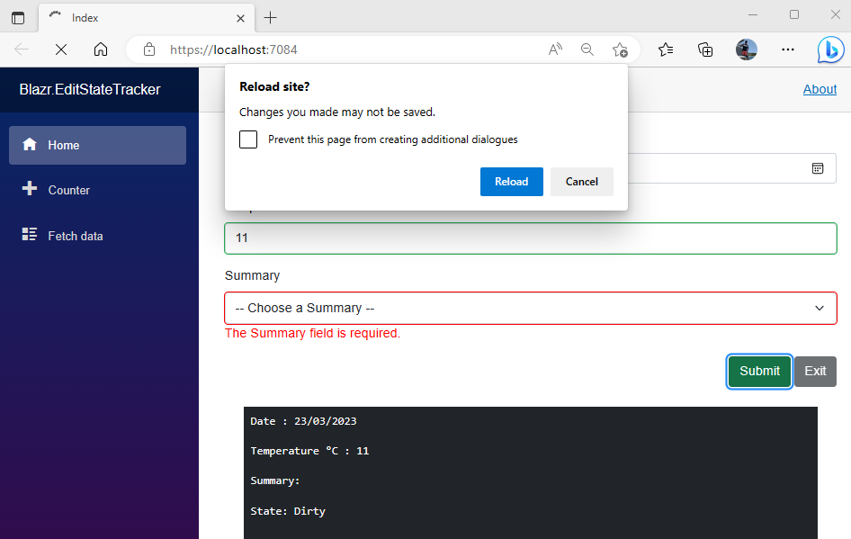

# Creating A Blazor Edit State Tracker

`EditContext` has no mechanism to store the initial state of model properties, and therefore doesn't track true state.  It simply registers that a value in a `InputBase` field has changed.  The value could change back to it's original and `EditContext` would still register it as modified.

This article demonstrates how to build an Edit State tracker for the Blazor `EditContext`.

> Note: this implementation only tracks flat single layer objects.  If you want to track nested objects, you need to build your own `EditContext`.

The screenshot below shows a dirty invalid form where I've clicked on the browser refresh button to try and exit the dirty form.



## How EditContext Currently Works

`EditContext` maintains an internal dictionary of *Edit States* defined as `FieldIdentifier`/`FieldState` pairs.

`FieldIdentifier` is defined as:

```csharp
public readonly struct FieldIdentifier : IEquatable<FieldIdentifier>
{
    public object Model { get; }
    public string FieldName { get; }
//....
}
```

And `FieldState` as:
```csharp
internal sealed class FieldState 
{
    public bool IsModified {get; set;}
    //...
}
``` 

All `InputBase` controls call `EditContext.NotifyFieldChanged` when they update.  `NotifyFieldChanged` adds or updates an entry in the Edit State dictionary, and raises the `OnFieldChanged` event.

```csharp
public event EventHandler<FieldChangedEventArgs>? OnFieldChanged;

public void NotifyFieldChanged(in FieldIdentifier fieldIdentifier)
{
    GetOrAddFieldState(fieldIdentifier).IsModified = true;
    OnFieldChanged?.Invoke(this, new FieldChangedEventArgs(fieldIdentifier));
}

internal FieldState GetOrAddFieldState(in FieldIdentifier fieldIdentifier)
{
    if (!_fieldStates.TryGetValue(fieldIdentifier, out var state))
    {
        state = new FieldState(fieldIdentifier);
        _fieldStates.Add(fieldIdentifier, state);
    }

    return state;
}

```

Field state is used by the `InputBase` components through some rather complicated Css Provider code to get the css formatting to the component.  *Green* for modified and valid, *Red* for invalid.  The code snippets from the various classes are shown below for reference.

The code that gets the Css for `InputBase`.

```caharp
protected string CssClass
{
    get
    {
        var fieldClass = EditContext?.FieldCssClass(FieldIdentifier);
        return AttributeUtilities.CombineClassNames(AdditionalAttributes, fieldClass) ?? string.Empty;
    }
}
```

The `FieldCssClass` method is an extendion method defined in `EditContextFieldClassExtensions`

```csharp
public static string FieldCssClass(this EditContext editContext, in FieldIdentifier fieldIdentifier)
{
    var provider = editContext.Properties.TryGetValue(FieldCssClassProviderKey, out var customProvider)
        ? (FieldCssClassProvider)customProvider
        : FieldCssClassProvider.Instance;

    return provider.GetFieldCssClass(editContext, fieldIdentifier);
}
```

And the default `FieldCssClassProvider` provider

```csharp
public class FieldCssClassProvider
{
    internal static readonly FieldCssClassProvider Instance = new FieldCssClassProvider();

    public virtual string GetFieldCssClass(EditContext editContext, in FieldIdentifier fieldIdentifier)
    {
        var isValid = !editContext.GetValidationMessages(fieldIdentifier).Any();
        if (editContext.IsModified(fieldIdentifier))
        {
            return isValid ? "modified valid" : "modified invalid";
        }
        else
        {
            return isValid ? "valid" : "invalid";
        }
    }
}
```

## Implementation

The implementation consists of four objects:

1. `TrackStateAttribute` - a custom attribute to identify properties to track.
2. `EditStateProperty` - a class to hold state data for a property.
3. `EditStateStore` - a collection class to hold the tracked `EditContext.Model` true state.
4. `EditStateTracker` - a component to embed in `EditForm` that wires everything up.

### TrackState

A custom attribute to identify tracked properties.

```csharp
public class TrackStateAttribute : Attribute {}
```

Appied to `WeatherForecast`:

```csharp
public class WeatherForecast
{
    [TrackState] public DateOnly Date { get; set; }
    [TrackState] public int TemperatureC { get; set; }
    public int TemperatureF => 32 + (int)(TemperatureC / 0.5556);
    [TrackState] [Required] public string? Summary { get; set; }
}
```

### EditStateProperty

An `EditStateProperty` tracks the state of individual properties.

```csharp
public class EditStateProperty
{
    public string Name { get; private set; }
    public object? BaseValue { get; private set; }
    public object? CurrentValue { get; private set; }

    public EditStateProperty(string name, object? value)
    {
        Name = name;
        BaseValue = value;
        CurrentValue= value;
    }

    public void Set(object? value)
        => CurrentValue = value;

    public bool IsDirty => !BaseValue?.Equals(CurrentValue) ?? CurrentValue is not null;
}
```

### EditStateStore

`EditStateStore` is the collection object that maintains the property state list.  The class gets the `EditContext` in the CTor and tracks  `EditContext.Model`.  It obtains the trackable properties through reflection and builds a list of `EditStateProperty` objects.

`Update` updates the property values and manages the true field state on `EditContext`.

`IsDirty` provides the object or an individual property state. 

```csharp
public class EditStateStore
{
    private object _model = new();

    private List<EditStateProperty> _properties = new();
    private EditContext _editContext;

    public EditStateStore(EditContext context)
    {
        _editContext = context;
        _model = context.Model;

        var props = _model.GetType().GetProperties().Where(
                prop => Attribute.IsDefined(prop, typeof(TrackStateAttribute)));

        foreach (var prop in props)
        {
            _properties.Add(new(prop.Name, prop.GetValue(_model)));
        }
    }

    public void Update(FieldChangedEventArgs e)
    {
        var property = _properties.FirstOrDefault(item => item.Name.Equals(e.FieldIdentifier.FieldName));

        if (property != null)
        {
            var propInfo = e.FieldIdentifier.Model.GetType().GetProperty(e.FieldIdentifier.FieldName);
            if (propInfo != null)
            {
                var value = propInfo.GetValue(e.FieldIdentifier.Model);
                property.Set(value);

                // If the value is clean clear out the modified setting in the Edit Context
                if (!IsDirty(e.FieldIdentifier.FieldName))
                    _editContext.MarkAsUnmodified(e.FieldIdentifier);
            }
        }
    }

    public bool IsDirty(string fieldName)
        => _properties.FirstOrDefault(item => item.Name.Equals(fieldName))?.IsDirty ?? false;
    
    public bool IsDirty()
        => _properties.Any(item => item.IsDirty);
}
```

### EditStateTracker

Finally a component to plug everything together in the `EditForm`.

The component:
1. Captures the `EditContext`.
2. Creates an `EditStateStore`.
3. Hooks up a handler to the `OnFieldChanged` event of `EditContext`.

`OnFieldChanged` calls `Update` on the store, and if the edit state has changed invokes `EditStateChanged`.

`LockNavigation` enables/disables navigation locking.  The UI adds the `NavigationLock` component and wires it up if required.

`OnLocationChanged` is the callback handler for `NavigationLock` and prevents navigation when the form is dirty.

```csharp
@implements IDisposable

@if(this.LockNavigation)
{
    <NavigationLock OnBeforeInternalNavigation=this.OnLocationChanged ConfirmExternalNavigation=_isDirty />
}

@code {
    [CascadingParameter] private EditContext _editContext { get; set; } = default!;
    [Parameter] public bool LockNavigation { get; set; }
    [Parameter] public EventCallback<bool> EditStateChanged { get; set; }

    private EditStateStore _store = default!;
    private bool _currentIsDirty = false;
    private bool _isDirty => _store.IsDirty();

    public EditStateTracker() { }

    protected override void OnInitialized()
    {
        ArgumentNullException.ThrowIfNull(_editContext);
        _store = new(_editContext);
        ArgumentNullException.ThrowIfNull(_store);
        _editContext.OnFieldChanged += OnFieldChanged;
    }

    private void OnFieldChanged(object? sender, FieldChangedEventArgs e)
    {
        _store.Update(e);

        if (_isDirty != _currentIsDirty)
        {
            _currentIsDirty = _isDirty;
            this.EditStateChanged.InvokeAsync(_isDirty);
        }
    }

    private void OnLocationChanged(LocationChangingContext context)
    {
        if (_isDirty)
            context.PreventNavigation();
    }

    public void Dispose()
        => _editContext.OnFieldChanged -= OnFieldChanged;
}
```

## The Edit Form

This is a very standard edit form.  Note:

1. The `EditStateTracker` component added to the `EditForm`.
2. Tracking edit state through  `EditStateChanged` on `EditStateTracker` and using it to change the state of the buttons.
3. Validation is included to show it works.
4. There's a mock save to demostrate how to implement it.

```html
@page "/"

<PageTitle>Index</PageTitle>

<EditForm EditContext=_editContext>
    <DataAnnotationsValidator />
    <EditStateTracker @ref=_editStateTracker EditStateChanged=this.OnEditStateChanged LockNavigation=true />

    <div class="mb-3">
        <label class="form-label">Date</label>
        <InputDate class="form-control" @bind-Value=this.model.Date />
    </div>

    <div class="mb-3">
        <label class="form-label">Temperature &deg;C</label>
        <InputNumber class="form-control" @bind-Value=this.model.TemperatureC />
    </div>

    <div class="mb-3">
        <label class="form-label">Summary</label>
        <InputSelect class="form-select" @bind-Value=this.model.Summary>
            @if (this.model.Summary is null)
            {
                <option disabled selected value=""> -- Choose a Summary --</option>
            }
            @foreach (var summary in Summaries)
            {
                <option value="@summary">@summary</option>
            }
        </InputSelect>
        <ValidationMessage For="() => this.model.Summary" />
    </div>

    <div class="mb-3 text-end">
        <button disabled="@(!_isDirty)" type="button" class="btn btn-success" @onclick=this.SaveAsync>Submit</button>
        <button disabled="@(_isDirty)" type="button" class="btn btn-dark">Exit</button>
    </div>

</EditForm>

<div class="bg-dark text-white m-4 p-2">
    <pre>Date : @this.model.Date</pre>
    <pre>Temperature &deg;C : @this.model.TemperatureC</pre>
    <pre>Summary: @this.model.Summary</pre>
    <pre>State: @(_isDirty ? "Dirty" : "Clean")</pre>
</div>

@code {
    private EditStateTracker? _editStateTracker;
    private bool _isDirty;
    private WeatherForecast model = new() { Date = DateOnly.FromDateTime(DateTime.Now), TemperatureC = 10 };
    private EditContext? _editContext;

    protected override void OnInitialized()
        => _editContext = new EditContext(model);

    private void OnEditStateChanged(bool isDirty)
        => _isDirty = isDirty;

    private async Task SaveAsync()
    {
        if (_editContext?.Validate() ?? false)
        {
            // mock an async call to the data pipeline to save the record
            await Task.Delay(100);
            // Error handling code here

            // This will reset the edit context and the EditStateTracker
            _editContext = new EditContext(model);
            _isDirty = false;
        }
    }

    private List<string> Summaries = new() { "Freezing", "Bracing", "Chilly", "Cool", "Mild", "Warm", "Balmy", "Hot", "Sweltering", "Scorching" };
}
```

### Refreshing/Resetting the Edit Context and State

There is no mechanism for refreshing or resetting the state because `EditContext` has no mechanism to do so.

In the form `SaveAsync` creates a new `EditContext` based on the saved model.  `EditForm` detects the new `EditContext`, and forces the Renderer to destroy the old components and rebuild it's content.


## Why `EditContext` is simple object based

`EditContext` builds it's `FieldIdentifier` objects like this: the `model` is always `EditContext.Model`.  You can't add field identifiers to the state for child objects in `Model`.

```csharp
    public FieldIdentifier Field(string fieldName)
        => new FieldIdentifier(this.Model, fieldName);
```
